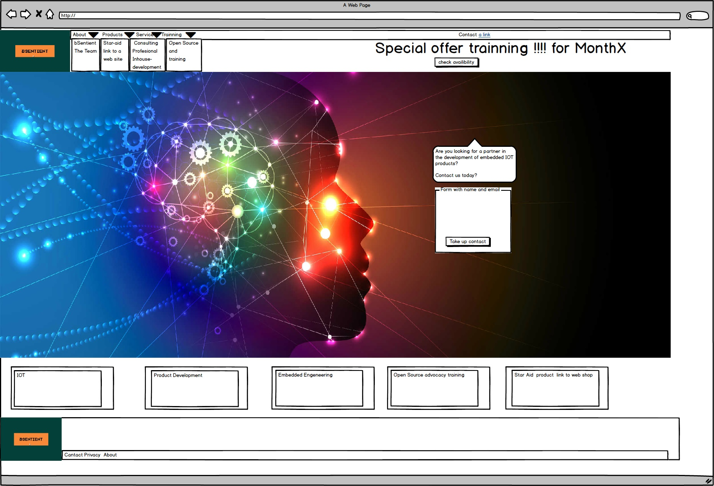
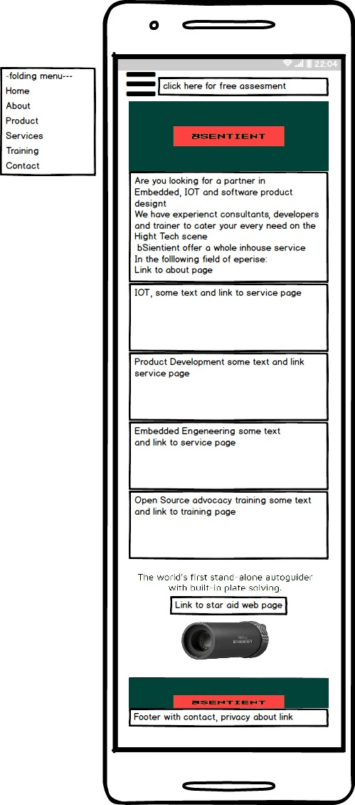

# bSentient Web page

This website will be used mainly by prospective customers of bSentient.  To the customer it is important to see what bSentient has to offer,  read about current bussines, products and services.  

The customer need to have and idea in which fields of technoley the company has expertieze.  And they need to contact bSentient with question and equries.
The customer also want to see what is the the newest product that they are working on.  

And if the customer is intrested in Training they need to see when a trainner is availble to book a session.

Click [here](https://lemoenskil.github.io/milestoneoneproject/) to see the website.

## UX
This website if for the potential and current customer for bSentient The company want to market their capability eg Services and Products via this page.   They would also use this site as comunication with intrested Customers.   And in the event that a customer is intrested in training they want to make sure that the customer can contact the company. The customer want to use this website to gain infromation on bSentient and to enquire about their services and products.  Also they want to use this website to introduce themselves and their capabilities to guide the user to their linked profile if they have one or busy setting up one.

### Strategy plane
see link to document
[the assignment](./user-design-experience/Strategy_Plane/Create_a_website_for_a_company_bSentient.pdf)

#### Create a website for a Engineering Consulting Company bSentient
    
    Build a static (front-end only) website for Engineering Consulting Company bSentient. As a starting
    point, you may want to use wireframes, as we did in the UX lesson (you can use Balsamiq or any other
    tool, including just pen and paper). You can use either your assets or the assets provided by bSentient.
    The Company is a startup that has just launch one in-house product and they are looking to get more
    exposure on their expertise and services that they have to offer.
    You have been given the following requirements after interviews with the client’s representatives:
    • Their primary target audiences are their customers and potential customer who wish to use the
    site to see what they have to offer in their field of expertise.
    • target customer by dummy newsletter/contact form
    -Also, the company would like to use the site to showcase their fields of expertise
    • a link to their current product web shop / video page
    • a page to show case training and where the customer can download some training material
    • Contact us page with contact form name/email/different topic enquiries
    The band has provided you, the developer, with the following assets that they would like to show case on
    their website:
    • Photos of the consultant
    • A video clip
    • Content:
    -about the
    -Information on their development services
    -information on their consulting services
    -information on their training
    • Power point presentation on training that can be downloaded for free
    • Also, they are in the process of creating a social media presence and would like to add links to
    their Facebook, Twitter pages.
    They also want you to add the personal linked link to the consultant LinkedIn profiles
    
#### User stories:
Stories:
- As a customer, I want to know more about bSentient, its owners and capabilities (eg project work on and skills), because I need to decide if they can help me solve my problem or staff my project.
- As a trainee or training manager, I want to know more about the trainings offered and the presentation medium (eg online or in classes), because I want to determine if any of the courses suit my needs and preferences.
- As a trainee or training manager, I want to know how the course or material is structured, because I want to determine if any of the courses suit my needs and preferences.
- As a recruiter, I want to know more about the background of each professional, because I need to determine if the contractor is a good fit for my contracting needs.
- As a project manager, I want to know more about the fields that bSentient Specialize in, because I need to determine whether bSentient is a suitable partner for my development outsourcing needs.
- As a customer, I want to read some bSentient success stories, because it gives me confidence that I have a reliable partner.
- As a customer, I want a example of customers bSentient already helped, because it gives me confidence that I have a reliable partner.
- As a customer, I want to link up with the owners and contractors via social media for the future, because I need as much information as possible to determine if they are the right partners for me.
- As a customer, I want to subscribe to the bSentient news feed, because I want to remain aware of new and updated products and trainings.

#### Putting it all in the strategy plane
see link to document
[Strategy plane](./user-design-experience/Strategy_Plane/Strategy_Plane.pdf)

        Strategy Plane
    What's the target market/culture?
    User are usually going to be from B2B, project managers, entrepreneurs looking for technology solutions. They will
    be in the front end of embedded, IOT and open source or they want a product that will be high-tech. The
    demography can be men and woman from all ages they are interested or working in the high-tech industry or are
    interested to create a IOT, embedded product or want to hire in consultant to create a product.
    Why is this so special?
    That customer/ potential customers be able to make enquiry about the company when they have a
    product that need to be developed. That customer/ potential customers be able to take up contact with
    the company about the training and that they can download free training material.
    Why would a user want this?
    IOT is a hot topic and there are a huge demand for the know how, in either product development,
    training or consulting. The user will want to have a clear picture on what they offer as solution. This
    site will be the gateway to access information on the company and the consultant’s capabilities. Also
    link the customer to a in house product that they have developed. Linked them to the linked in profiles
    of the consultant.
    What makes a good bSentient experience?
    • Reading about their services on offer.
    • Watching their videos of their product.
    • Seeing free training material.
    • Connecting with the consultant.
    o Connect on linked, Facebook
    What does the user expect?
    • What is this?
    o The expertise needs to be prominent. Example Embedded, IOT and Open Source…..
    • Is this what I expected to see?
    o Logo, high-tech feel and look with futuristic fond for heading and networks pictures
    showing connectivity. Also space/ stars to be used for the one product that they have
    developed
    • Does it offer what I want?
    o Videos, downloads, testimonials, blogs contact form and special offers.
    • Does it valuable enough to stay?
    o Content (free downloads and the special offer requests) will compel them to stay.
    • What actions can I take now?
    o Free assessment (can be achieved with pop-up form)..
    o Contact us.(on a Contact us page).
    o Connect with them on social media (NB Ought to be in a new _blank window).
    • How do I contact someone
    o Asking for an assessment of enquiry or/and connecting on social media.
    
    to see feasibility matrix go to 
    [Strategy plane](./user-design-experience/Strategy_Plane/Strategy_Plane.pdf)
    
### Scope Plane
see link to document
[Scope Plane](./user-design-experience/Scope_Plane/Scope_Plane.pdf)
    
    What they say they need
    • A Website.
    • Customers and potential customer can read about the company and see what they can do and
    what they have done
    • The company needs a medium in which the they can be contacted with potential leads.
    • To showcase on their new product, a video clip and a way to link the customer to the webstore.
    • To showcase the training that they can give and a link to some material downloads
    • To add links to their Linked, Facebook and pages which are currently being created.
    What they actually need
    • A mobile-first responsive website.
    • A contact page.
    • A page to showcase their professional services to the customer/ potential customer.
    • Links to their social media platforms and web shop.
    What they don’t know they need
    • A ‘sign up for the newsletter" pop up to get the latest product development and training news.
    • At a later time possibly a online booking agenda for the training.
    • A marketing slogan where there is a special on training eg if you book now or a free quote for a
    Product development project
    
    See senario and requirements match in document see link
    [Scope Plane](./user-design-experience/Scope_Plane/Scope_Plane.pdf)

### Structure Plane
see link to document
[Structure Plane](./user-design-experience/Structure_Plane/Structure_Plane.pdf)

    Information Architecture
    Will be a simple tree structure using a horizontal bar near the top of the page taking up the right two
    thirds of the page.
    Interaction Design (IXD)
    • Site Logo will bring user back to home as well as having ‘Home’ on the navigation bar in case
    some un-tech savvy users don’t know this convention.
    • Each Menu heading will have some sort of roll over to confirm that clicking that area has an
    action.
    • Each navigation button will have a particular color, which will be used on its corresponding page
    to visually confirm what page they are on.
    o On mobile device the hamburger icon will be used.
    • The ‘Special offer for training and free first assessment ’ information will be at the top of each
    page.
    o It will bring up a pop-up with a simple form that asks for their first name and last name
    and email address.
    o A radio button to choose what it will be eg training , development , consulting.
    o We will include that their email won’t be passed on to anyone else.
    o We will provide a message once they have successfully completed the form and hit the
    submit button.
    • The social links to Facebook, LinkedIn will have roll-over effects and open in a blank window.
    • On the landing page section there will be 5 block with a short description and if you click on it
    will take you to either to the product, service or training page
    • In the footer there will be links to about and Contact and Privacy statement, this will be on all
    the pages
    
    see document for diagram:
    [Structure Plane](./user-design-experience/Structure_Plane/Structure_Plane.pdf)
    
**Note that the  final product there was some changes as the customer was not thet focused on teh privacy statement as it s still working on that also they did not need to to see the need for a pop up on each page.  Als they did not want different color per page as it is not seemed fit for a prefesional company (and was looking more for background pictures to fit IOT and AI (arifical networks).They also wanted an ectra selection on the form as they need to know which field of technology the cusomer was intrested in.   They wanted the sosial media logo as they are going to us it in the future*

### Skeleton Plane

#### mockups:

In the links below you can see the mockups that I drew using the mockup tool “Balsamiq”:

- 
**Note that the final design has changed from the original design in the mockups. The reason why it has changed is because I was trying different layouts while I was experimenting and learning the code and sometimes the new designs looked better than the original ones or was just more responsive. In the desktop design the block with information was not that dominant which I have changed it the and made bigger and put is on the background picture.   Als have I centered the Main information block and added a madal with a button.  On the mobile design I have added no picture and have just made use of the info block and made sure the button was visable for the user.  I have also replaced the logo at the footer and put the links for contact and sosial media*

<h2>Features</h2>
In this section, you should go over the different parts of your project, and describe each in a sentence or so.

<h4>Existing Features</h4>
Feature 1 - allows users X to achieve Y, by having them fill out Z
...
For some/all of your features, you may choose to reference the specific project files that implement them, although this is entirely optional.

In addition, you may also use this section to discuss plans for additional features to be implemented in the future:

<h4>Features Left to Implement</h4>
Another feature idea

<h2>Technologies Used</h2>
In this section, you should mention all of the languages, frameworks, libraries, and any other tools that you have used to construct this project. For each, provide its name, a link to its official site and a short sentence of why it was used.

JQuery
The project uses JQuery to simplify DOM manipulation.

<h2>Testing</h2>
In this section, you need to convince the assessor that you have conducted enough testing to legitimately believe that the site works well. Essentially, in this part you will want to go over all of your user stories from the UX section and ensure that they all work as intended, with the project providing an easy and straightforward way for the users to achieve their goals.

Whenever it is feasible, prefer to automate your tests, and if you've done so, provide a brief explanation of your approach, link to the test file(s) and explain how to run them.

For any scenarios that have not been automated, test the user stories manually and provide as much detail as is relevant. A particularly useful form for describing your testing process is via scenarios, such as:

Contact form:
Go to the "Contact Us" page
Try to submit the empty form and verify that an error message about the required fields appears
Try to submit the form with an invalid email address and verify that a relevant error message appears
Try to submit the form with all inputs valid and verify that a success message appears.
In addition, you should mention in this section how your project looks and works on different browsers and screen sizes.

You should also mention in this section any interesting bugs or problems you discovered during your testing, even if you haven't addressed them yet.

If this section grows too long, you may want to split it off into a separate file and link to it from here.

<h2>Deployment</h2>
This section should describe the process you went through to deploy the project to a hosting platform (e.g. GitHub Pages or Heroku).

In particular, you should provide all details of the differences between the deployed version and the development version, if any, including:

Different values for environment variables (Heroku Config Vars)?
Different configuration files?
Separate git branch?
In addition, if it is not obvious, you should also describe how to run your code locally.

## Credits
- Content
The text for section Y was copied from the Wikipedia article Z
- Media
- 
**Photos used**:

   ID 111718113 © Vs1489 | Dreamstime.com

   ID 134781260 © Siarhei Yurchanka | Dreamstime.com
   
   ID 50626138 © Maciek905 - Dreamstime.com

- Acknowledgements
I received inspiration for this project from X